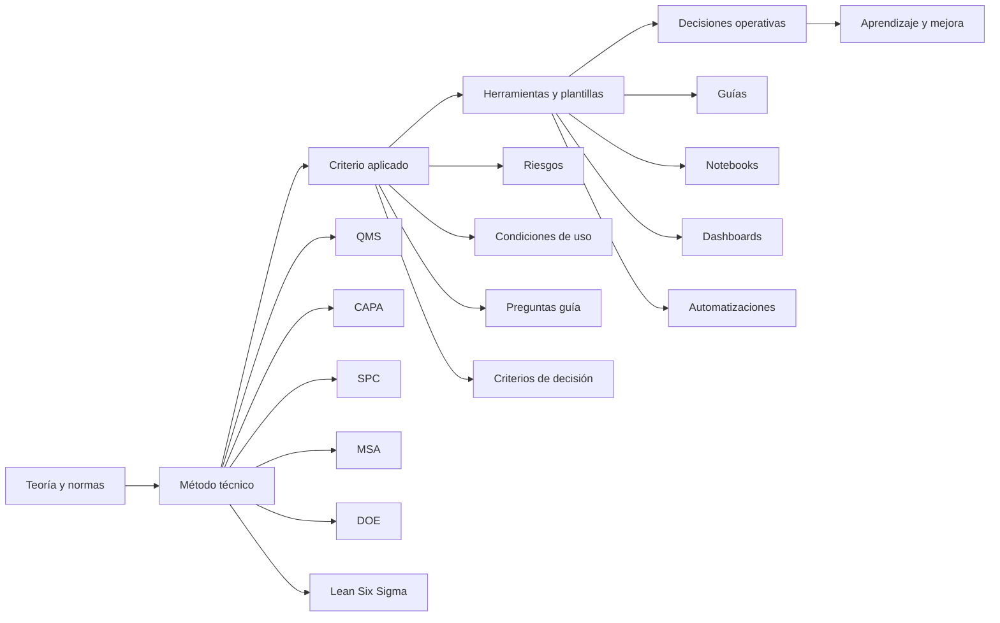
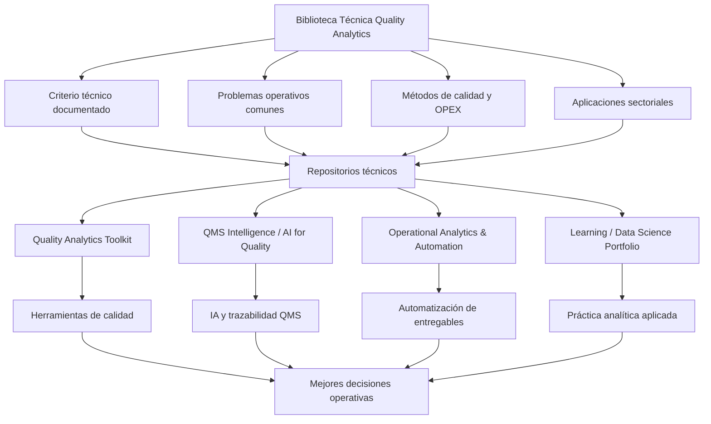
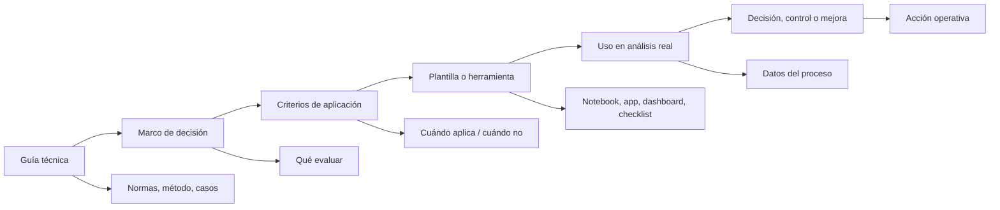
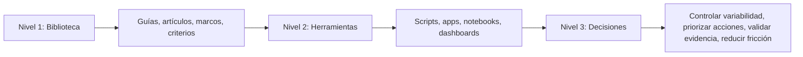

# Francisco González

Construyo conocimiento técnico, guías aplicadas y herramientas analíticas para conectar calidad, excelencia operacional, sistemas de gestión y datos con mejores decisiones operativas.

Mi enfoque combina experiencia de planta, Lean Six Sigma, estadística aplicada, QMS, automatización e inteligencia artificial aplicada a calidad. La parte técnica es un medio para un fin: ayudar a profesionales y organizaciones a entender mejor sus procesos, reducir variabilidad, fortalecer evidencia y decidir con más claridad.

Este GitHub está organizado alrededor de un activo principal: la **Biblioteca Técnica Quality Analytics**. Los repositorios, notebooks, scripts y herramientas funcionan como extensiones prácticas de esa biblioteca.

> Convertir teoría, método y experiencia operativa en criterios, herramientas y decisiones aplicables.

---

## Biblioteca Técnica Quality Analytics

La [Biblioteca Técnica Quality Analytics](TECHNICAL_LIBRARY.md) es el centro de este ecosistema.

Reúne guías y artículos técnicos desarrollados para conectar sistemas de gestión, auditoría, CAPA, SPC, MSA, DOE, excelencia operacional, analítica e inteligencia artificial aplicada con problemas reales de calidad y operación.

Su valor no está solo en documentar teoría. Está en traducir métodos técnicos en criterios de aplicación, preguntas de diagnóstico, riesgos, controles, ejemplos sectoriales y decisiones operativas.

La biblioteca trabaja en cuatro líneas principales:

| Línea | Qué conecta | Ejemplos |
|---|---|---|
| Sistemas de gestión y auditoría | Normas, evidencia, hallazgos y mejora | ISO 9001, ISO 19011, CAPA, causa raíz |
| Calidad basada en datos | Variación, medición, estabilidad y capacidad | MSA, SPC, DOE, IA aplicada a QMS |
| Calidad sectorial y OPEX aplicada | Método técnico en contextos industriales y de servicio | Empaques para alimentos, ingenios azucareros, clínicas dentales |
| Artículos técnicos especializados | Decisiones técnicas con mayor profundidad | costo de no calidad, estadística bayesiana, validación de software |

[Explorar la Biblioteca Técnica](TECHNICAL_LIBRARY.md)

---

## Qué problemas trabajo

Trabajo en la intersección entre calidad, operaciones y analítica aplicada. Los problemas que más me interesan son aquellos donde existe información disponible, pero todavía no se traduce en mejores decisiones.

- Indicadores de calidad que se reportan, pero no cambian acciones.
- Sistemas de medición que agregan variación al proceso.
- Reclamos, defectos y desviaciones sin lectura estadística clara.
- Procesos con variabilidad conocida, pero sin planes de reacción sólidos.
- QMS con mucha documentación y poca trazabilidad de decisiones.
- Reportes manuales que consumen tiempo y generan bajo aprendizaje operativo.
- Herramientas de IA aplicadas a calidad sin suficiente validación, gobierno o criterio técnico.

---

## Mapa del ecosistema

La lógica del portafolio es simple: la biblioteca organiza el criterio; los repositorios lo convierten en herramientas; las herramientas ayudan a decidir mejor.

---

## Repositorios principales

| Línea de trabajo | Rol dentro del ecosistema | Ejemplos de herramientas |
|---|---|---|
| [Quality Analytics Toolkit](https://github.com/fjgonzalezmgt/Quality-Analytics-Toolkit) | Convertir métodos clásicos de calidad en herramientas operativas | SPC, capacidad de proceso, Gage R&R, AQL, DOE, FMEA, causa raíz |
| [QMS Intelligence / AI for Quality](https://github.com/fjgonzalezmgt/QMS-Intelligence-AI-for-Quality) | Explorar IA aplicada a documentación, evidencia y trazabilidad QMS | SOPs, CAPA, auditorías, reclamos, especificaciones, RAG, recuperación de evidencia |
| [Operational Analytics & Automation](https://github.com/fjgonzalezmgt/Operational-Analytics-Automation) | Automatizar reportes, documentos y flujos técnicos reutilizables | generación documental, automatización, dashboards, scripts, entregables profesionales |
| [Learning / Data Science Portfolio](https://github.com/fjgonzalezmgt/Learning-Data-Science-Portfolio) | Documentar evolución técnica en analítica y ciencia de datos | EDA, visualización, modelos, notebooks, proyectos aplicados |

---

## Cómo se convierte el conocimiento en herramienta

Este flujo es importante porque evita separar artificialmente contenido y tecnología. Una guía técnica bien diseñada puede convertirse en checklist, herramienta analítica, clase, dashboard, script, plantilla o sistema de apoyo a decisiones.

---

## Capacidades demostradas

- Traducir teoría, normas y métodos de calidad en criterios prácticos de decisión.
- Diseñar guías técnicas que conectan conceptos con aplicación operativa.
- Convertir métodos de calidad en herramientas reproducibles.
- Diseñar análisis estadísticos aplicados a procesos reales.
- Automatizar reportes, documentos y flujos técnicos.
- Conectar QMS, CAPA, auditorías y reclamos con analítica e IA.
- Convertir información operativa dispersa en criterios de decisión.
- Integrar experiencia de planta con Python, Power BI, R/Shiny, automatización e inteligencia artificial aplicada.

---

## Cómo leer este perfil

Este perfil puede leerse en tres niveles.

El código es una parte del valor, no el punto de partida. El foco está en cómo cada recurso ayuda a interpretar mejor un proceso, sostener una mejora o reducir la distancia entre teoría, análisis y ejecución.

---

## Temas de interés

**Sistemas de calidad y mejora**  
QMS · ISO 9001 · ISO 19011 · auditorías · CAPA · causa raíz · reclamos · SPC · MSA · Gage R&R · capacidad de proceso · FMEA · DOE

**Analítica y automatización**  
Python · Power BI · R/Shiny · automatización de reportes · dashboards · análisis estadístico · documentación técnica · herramientas reproducibles

**Quality 4.0 e IA aplicada**  
AI for Quality · RAG para documentación técnica · QMS Intelligence · trazabilidad de evidencia · revisión humana · gobierno del dato · validación basada en riesgo

---

## Sobre Quality Analytics

[Quality Analytics](https://qualityanalytics.net) es mi plataforma de conocimiento aplicado para conectar calidad, operaciones y datos.

El objetivo es construir guías, herramientas, contenido técnico, formación y activos reutilizables que ayuden a profesionales y organizaciones a pasar de reportar problemas a gestionarlos con método, evidencia y criterio operativo.

La tecnología amplifica el criterio; no reemplaza la responsabilidad profesional.

---

## Enlaces

- [Quality Analytics](https://qualityanalytics.net)
- [Biblioteca Técnica](TECHNICAL_LIBRARY.md)
- [LinkedIn](https://www.linkedin.com/in/franciscogonzalez)
- [GitHub](https://github.com/fjgonzalezmgt)
