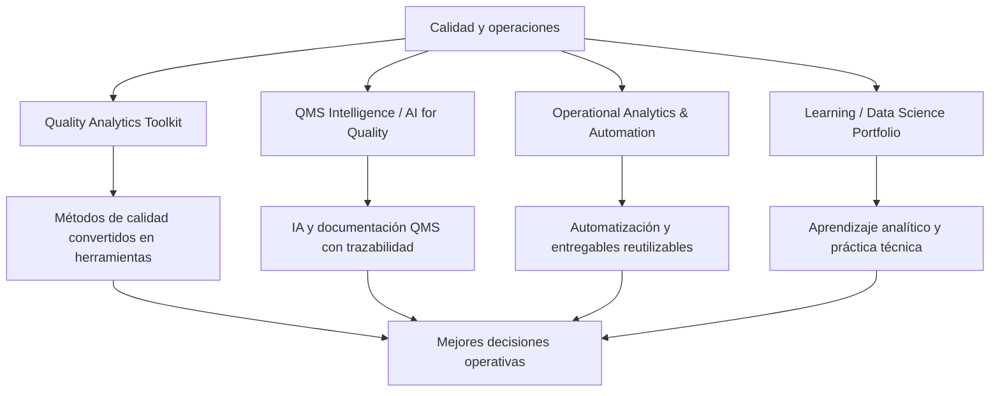

# Francisco González

Profesional senior en calidad, excelencia operacional, Lean Six Sigma y analítica aplicada a operaciones.

Mi trabajo conecta experiencia de planta, métodos estadísticos de calidad, automatización, inteligencia artificial y análisis de datos para convertir información operativa en mejores decisiones.

No uso datos solo para reportar desempeño.

Los uso para entender procesos, reducir fricción, controlar variabilidad, mejorar sistemas de calidad y construir herramientas prácticas que puedan usarse en contextos reales de operación.

## Enfoque profesional

Trabajo en la intersección de:

- calidad y sistemas de gestión;
- excelencia operacional y Lean Six Sigma;
- control estadístico de procesos;
- sistemas de medición;
- análisis de capacidad;
- automatización de reportes y documentos;
- analítica aplicada a operaciones;
- inteligencia artificial aplicada a QMS y toma de decisiones.

Mi propuesta de valor es simple:

> Convertir datos, método y experiencia operativa en herramientas que ayuden a decidir mejor.

## Repositorios principales

### 1. Quality Analytics Toolkit

[Quality Analytics Toolkit](https://github.com/fjgonzalezmgt/Quality-Analytics-Toolkit)

Herramientas prácticas para calidad, mejora continua y análisis estadístico aplicado.

Incluye proyectos relacionados con:

- SPC;
- capacidad de proceso;
- Gage R&R;
- AQL y muestreo;
- AMEF/FMEA;
- DOE;
- causa raíz.

Este hub muestra cómo convertir métodos clásicos de calidad en flujos más operativos usando datos reales.

### 2. QMS Intelligence / AI for Quality

[QMS Intelligence / AI for Quality](https://github.com/fjgonzalezmgt/QMS-Intelligence-AI-for-Quality)

Proyectos orientados a inteligencia documental e inteligencia artificial aplicada a sistemas de gestión de calidad.

El foco está en conectar:

- SOPs;
- CAPA;
- auditorías;
- reclamos;
- especificaciones;
- documentación QMS;
- evidencia operativa;
- trazabilidad de decisiones.

La idea central es usar IA para recuperar evidencia, reducir fricción documental y apoyar decisiones de calidad sin reemplazar el criterio profesional.

### 3. Operational Analytics & Automation

[Operational Analytics & Automation](https://github.com/fjgonzalezmgt/Operational-Analytics-Automation)

Proyectos de automatización, generación documental y flujos de trabajo profesionales.

Incluye herramientas y estructuras para convertir información, texto y criterios técnicos en entregables más consistentes, revisables y reutilizables.

El objetivo es reducir trabajo manual y mejorar la conexión entre análisis, comunicación y acción.

### 4. Learning / Data Science Portfolio

[Learning / Data Science Portfolio](https://github.com/fjgonzalezmgt/Learning-Data-Science-Portfolio)

Portafolio de aprendizaje aplicado, análisis exploratorio, visualización y proyectos de data science.

Esta línea documenta evolución técnica y práctica analítica en distintos contextos, como complemento a mi enfoque principal en calidad, operaciones y datos.

## Biblioteca Técnica Quality Analytics

Mantengo una biblioteca curada de guías y artículos técnicos sobre sistemas de gestión de calidad, auditoría, CAPA, SPC, MSA, excelencia operacional, analítica e inteligencia artificial aplicada a calidad.

Estos recursos complementan los proyectos, notebooks, dashboards y herramientas analíticas de este portafolio.

[Explorar la Biblioteca Técnica](TECHNICAL_LIBRARY.md)

## Cómo leer este perfil

Este GitHub no está organizado como una colección de scripts aislados.

Está organizado como un ecosistema profesional alrededor de una idea:

> Calidad basada en datos para decisiones operativas mejores.

Los repositorios principales muestran cuatro capacidades complementarias:

## Temas de interés

- Quality Analytics
- Operational Excellence
- Lean Six Sigma
- SPC
- MSA / Gage R&R
- Process Capability
- FMEA
- DOE
- CAPA
- QMS
- Data Analytics
- Power BI
- Python
- R / Shiny
- AI for Quality
- RAG aplicado a documentación técnica
- Automatización de reportes y entregables

## Sobre Quality Analytics

Quality Analytics es mi plataforma de conocimiento aplicado para conectar calidad, operaciones y datos.

El objetivo es construir herramientas, contenido técnico, formación y activos reutilizables que ayuden a profesionales y organizaciones a pasar de reportar problemas a gestionarlos con método, evidencia y criterio operativo.

## Enlaces

- [Quality Analytics](https://qualityanalytics.net)
- [LinkedIn](https://www.linkedin.com/in/franciscogonzalez)
- [GitHub](https://github.com/fjgonzalezmgt)
