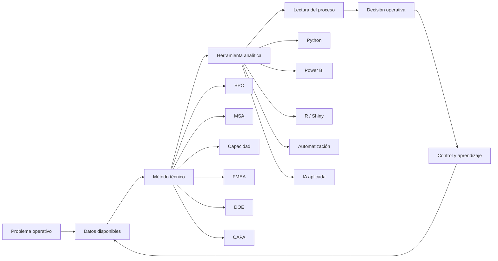
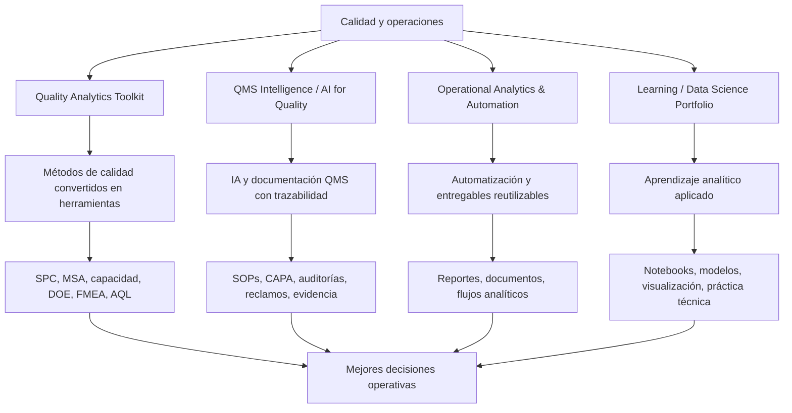
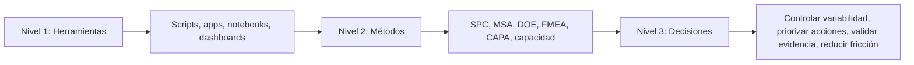

# Francisco González

Construyo herramientas, notebooks y sistemas analíticos para convertir métodos de calidad, excelencia operacional y datos operativos en mejores decisiones.

Mi enfoque combina experiencia de planta, Lean Six Sigma, estadística aplicada, sistemas de gestión de calidad, automatización e inteligencia artificial aplicada a QMS.

Este GitHub no está organizado como una colección de scripts aislados. Es un portafolio técnico aplicado para mostrar cómo los métodos de calidad pueden convertirse en herramientas prácticas para analizar procesos, reducir variabilidad, mejorar trazabilidad y sostener decisiones operativas.

> Convertir datos, método y experiencia operativa en herramientas que ayuden a decidir mejor.

---

## Qué problemas trabajo

Trabajo en la intersección entre calidad, operaciones y analítica aplicada. Los problemas que más me interesan son aquellos donde existe información disponible, pero todavía no se traduce en mejores decisiones.

- Indicadores de calidad que se reportan, pero no cambian acciones.
- Sistemas de medición que agregan variación al proceso.
- Reclamos, defectos y desviaciones sin lectura estadística clara.
- Procesos con variabilidad conocida, pero sin planes de reacción sólidos.
- QMS con mucha documentación y poca trazabilidad de decisiones.
- Reportes manuales que consumen tiempo y generan bajo aprendizaje operativo.
- Herramientas de IA aplicadas a calidad sin suficiente validación, gobierno o criterio técnico.

---

## Mapa del enfoque

La tecnología aporta valor cuando se conecta con un problema real, datos confiables, método adecuado y una decisión que mejora. Sin esa conexión, el análisis se queda en reporte o la automatización solo acelera un sistema débil.

---

## Repositorios principales

| Línea de trabajo | Problema que aborda | Ejemplos de herramientas |
|---|---|---|
| [Quality Analytics Toolkit](https://github.com/fjgonzalezmgt/Quality-Analytics-Toolkit) | Convertir métodos clásicos de calidad en herramientas operativas | SPC, capacidad de proceso, Gage R&R, AQL, DOE, FMEA, causa raíz |
| [QMS Intelligence / AI for Quality](https://github.com/fjgonzalezmgt/QMS-Intelligence-AI-for-Quality) | Reducir fricción documental y mejorar trazabilidad en sistemas de calidad | SOPs, CAPA, auditorías, reclamos, especificaciones, RAG, recuperación de evidencia |
| [Operational Analytics & Automation](https://github.com/fjgonzalezmgt/Operational-Analytics-Automation) | Automatizar reportes, documentos y flujos técnicos reutilizables | generación documental, automatización, dashboards, scripts, entregables profesionales |
| [Learning / Data Science Portfolio](https://github.com/fjgonzalezmgt/Learning-Data-Science-Portfolio) | Documentar evolución técnica en analítica y ciencia de datos | EDA, visualización, modelos, notebooks, proyectos aplicados |

---

## Ecosistema técnico

La lógica del portafolio es simple: tomar problemas reales de calidad y operación, aplicar método técnico, construir herramientas reproducibles y documentar el criterio detrás de cada decisión.

---

## Capacidades demostradas

- Traducir métodos de calidad en herramientas reproducibles.
- Diseñar análisis estadísticos aplicados a procesos reales.
- Automatizar reportes, documentos y flujos técnicos.
- Conectar QMS, CAPA, auditorías y reclamos con analítica e IA.
- Convertir información operativa dispersa en criterios de decisión.
- Documentar herramientas de forma clara para usuarios técnicos.
- Integrar experiencia de planta con Python, Power BI, R/Shiny, automatización e inteligencia artificial aplicada.

---

## Cómo leer este perfil

Este perfil puede leerse en tres niveles.

El código es solo una parte del valor. El foco está en cómo cada herramienta ayuda a interpretar mejor un proceso, sostener una mejora o reducir la distancia entre análisis y ejecución.

---

## Biblioteca técnica Quality Analytics

Además del código, mantengo una biblioteca curada de guías y artículos técnicos sobre sistemas de gestión de calidad, auditoría, CAPA, SPC, MSA, excelencia operacional, analítica e inteligencia artificial aplicada a calidad.

La intención es conectar tres niveles:

1. Método técnico.
2. Herramienta analítica.
3. Decisión operativa.

[Explorar la Biblioteca Técnica](TECHNICAL_LIBRARY.md)

---

## Temas de interés

**Calidad y mejora**  
SPC · MSA · Gage R&R · capacidad de proceso · FMEA · DOE · CAPA · causa raíz · QMS · auditorías · reclamos

**Analítica y automatización**  
Python · Power BI · R/Shiny · automatización de reportes · dashboards · análisis estadístico · documentación técnica

**Quality 4.0 e IA aplicada**  
AI for Quality · RAG para documentación técnica · QMS Intelligence · trazabilidad de evidencia · revisión humana · gobierno del dato

---

## Sobre Quality Analytics

[Quality Analytics](https://qualityanalytics.net) es mi plataforma de conocimiento aplicado para conectar calidad, operaciones y datos.

El objetivo es construir herramientas, contenido técnico, formación y activos reutilizables que ayuden a profesionales y organizaciones a pasar de reportar problemas a gestionarlos con método, evidencia y criterio operativo.

La tecnología amplifica el criterio; no reemplaza la responsabilidad profesional.

---

## Enlaces

- [Quality Analytics](https://qualityanalytics.net)
- [LinkedIn](https://www.linkedin.com/in/franciscogonzalez)
- [GitHub](https://github.com/fjgonzalezmgt)
