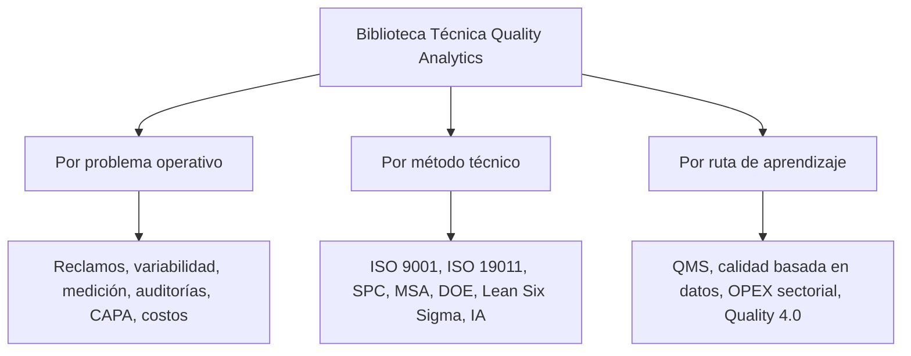
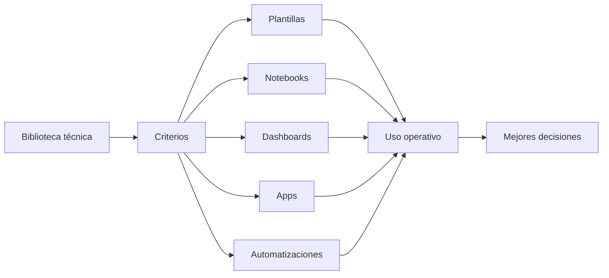

# Biblioteca Técnica Quality Analytics

La Biblioteca Técnica Quality Analytics reúne guías y artículos desarrollados para conectar teoría, normas, métodos de calidad, excelencia operacional, analítica e inteligencia artificial aplicada con decisiones reales en operación.

No es solo un archivo de documentos. Es una base de conocimiento aplicada para profesionales que necesitan pasar de entender conceptos a tomar mejores decisiones sobre procesos, medición, variabilidad, auditorías, CAPA, indicadores, sistemas de gestión y uso responsable de tecnología.

El valor de esta biblioteca está en traducir conocimiento técnico en:

- criterios de aplicación;
- preguntas de diagnóstico;
- riesgos y controles;
- rutas de implementación;
- ejemplos sectoriales;
- herramientas y plantillas futuras;
- decisiones operativas mejor sustentadas.

---

## Propósito

La mayoría de organizaciones ya tiene procedimientos, indicadores, auditorías, reportes y datos. El problema aparece cuando esa información no cambia decisiones.

Esta biblioteca busca reducir esa brecha.

Cada recurso intenta responder una pregunta práctica:

> ¿Qué debe entender, evaluar o decidir mejor un profesional de calidad, operaciones o mejora continua después de leer esto?

---

## Cómo usar esta biblioteca

La biblioteca puede leerse de tres formas.

La lectura recomendada no es necesariamente lineal. Conviene empezar por el problema que se necesita resolver y luego profundizar en el método.

---

## Mapa por problema operativo

| Problema operativo | Recursos recomendados | Decisión que ayuda a mejorar |
|---|---|---|
| El sistema de calidad existe, pero no se traduce en gestión efectiva | ISO 9001, auditoría ISO 19011, CAPA | Priorizar qué procesos, riesgos, evidencias e indicadores deben gobernarse mejor |
| Hay hallazgos, reclamos o desviaciones recurrentes | CAPA y causa raíz, costo de no calidad, auditoría | Decidir cuándo contener, cuándo investigar y cómo verificar efectividad |
| Los datos de calidad no son confiables | MSA, Gage R&R, SPC | Evaluar si el sistema de medición permite tomar decisiones válidas |
| El proceso muestra variación, pero las acciones son reactivas | SPC, capacidad de proceso, DOE | Separar variación común y especial, definir señales y planes de reacción |
| Hay pérdidas, reprocesos o reclamos sin priorización económica clara | Costo de no calidad, CAPA, Lean Six Sigma | Convertir pérdidas operativas en oportunidades priorizadas de mejora |
| Se quiere aplicar IA en calidad sin debilitar control técnico | IA aplicada a QMS, MSA y SPC; validación de software | Definir casos de uso con trazabilidad, revisión humana, validación y gobierno |
| Se necesita aplicar calidad y OPEX en un sector específico | Empaques para alimentos, ingenios azucareros, clínicas dentales | Adaptar métodos generales a restricciones, riesgos y flujos reales del sector |

---

## Rutas sugeridas de lectura

### Ruta 1: Fortalecer un sistema de gestión de calidad

Para responsables de QMS, auditores internos, líderes de calidad o equipos que necesitan convertir la norma en un sistema operativo.

1. [Guía práctica para implementar ISO 9001](https://qualityanalytics.net/wp-content/uploads/2026/05/guia_implementacion_iso_9001_2026.pdf)
2. [Guía completa de auditoría de sistemas de gestión basada en ISO 19011](https://qualityanalytics.net/wp-content/uploads/2026/05/guia_auditoria_iso_19011_2026.pdf)
3. [Guía práctica de CAPA y causa raíz](https://qualityanalytics.net/wp-content/uploads/2026/05/guia_capa_calidad_opex.pdf)

Lectura central: diseñar un sistema donde procesos, riesgos, evidencia, auditorías y acciones correctivas estén conectados.

---

### Ruta 2: Construir calidad basada en datos

Para profesionales que necesitan mejorar la confiabilidad de mediciones, interpretar variación y sostener decisiones con datos.

1. [Medir bien antes de decidir: MSA, Gage R&R y confiabilidad de mediciones](https://qualityanalytics.net/wp-content/uploads/2026/06/guia_msa_2026.pdf)
2. [SPC aplicado: de la gráfica al control del proceso](https://qualityanalytics.net/wp-content/uploads/2026/06/guia_spc_calidad_opex.pdf)
3. [Guía práctica de DOE para calidad y mejora de procesos](https://qualityanalytics.net/wp-content/uploads/2026/06/guia_doe_metodos_relacionados.pdf)

Lectura central: antes de mejorar un proceso, hay que saber si se mide bien, si el proceso es estable y qué variables realmente explican el desempeño.

---

### Ruta 3: Conectar OPEX con resultados operativos

Para líderes de mejora continua, Black Belts, gerentes de planta y equipos que necesitan priorizar mejoras con impacto real.

1. [Herramientas de excelencia operacional y calidad 2026](https://qualityanalytics.net/wp-content/uploads/2026/04/herramientas_excelencia_operacional_calidad_2026.pdf)
2. [Costo de no calidad: cómo convertir pérdidas en decisiones de mejora](https://qualityanalytics.net/wp-content/uploads/2026/05/articulo_costo_no_calidad.pdf)
3. [Guía práctica para Black Belts en Ingenios Azucareros](https://qualityanalytics.net/wp-content/uploads/2026/05/guia_black_belt_ingenios.pdf)

Lectura central: la mejora continua aporta más cuando conecta pérdidas, datos, método, ejecución y sostenimiento.

---

### Ruta 4: Aplicar IA en calidad con criterio técnico

Para profesionales que exploran IA, automatización documental, RAG, clasificación, asistentes técnicos o sistemas aumentados en QMS.

1. [IA aplicada a QMS, MSA y SPC](https://qualityanalytics.net/wp-content/uploads/2026/05/ia_qms_msa_spc.pdf)
2. [Validación de software open source en entornos regulados](https://qualityanalytics.net/wp-content/uploads/2026/04/guia_validacion_software_newsletter.pdf)
3. [Medir bien antes de decidir: MSA, Gage R&R y confiabilidad de mediciones](https://qualityanalytics.net/wp-content/uploads/2026/06/guia_msa_2026.pdf)

Lectura central: la IA puede reducir fricción, recuperar evidencia y mejorar documentación, pero necesita datos confiables, validación, trazabilidad, revisión humana y gobierno.

---

### Ruta 5: Aplicar calidad y mejora en contextos sectoriales

Para equipos que necesitan adaptar principios generales a restricciones reales de industria, servicio, flujo, cliente y regulación.

1. [Guía introductoria para Ingenieros de Calidad en Empaques para Alimentos](https://qualityanalytics.net/wp-content/uploads/2026/04/guia_cqe_empaques.pdf)
2. [Guía práctica para Black Belts en Ingenios Azucareros](https://qualityanalytics.net/wp-content/uploads/2026/05/guia_black_belt_ingenios.pdf)
3. [Lean Healthcare aplicado a clínicas dentales](https://qualityanalytics.net/wp-content/uploads/2026/06/lean_healthcare_clinica_dental.pdf)

Lectura central: el método importa, pero la aplicación depende del proceso, los riesgos, las personas, los datos disponibles y las decisiones que deben mejorar.

---

## Índice completo de recursos

## 1. Sistemas de gestión de calidad y auditoría

### [Guía práctica para implementar ISO 9001](https://qualityanalytics.net/wp-content/uploads/2026/05/guia_implementacion_iso_9001_2026.pdf)

Ruta práctica para implementar sistemas de gestión de calidad: contexto, procesos, riesgos, controles, evidencia, indicadores, mejora y preparación para certificación.

**Útil para:** responsables de calidad, dueños de proceso, equipos de implementación y alta dirección.  
**Decisión que mejora:** cómo convertir la norma en un sistema de gestión operativo, no solo documental.

### [Guía completa de auditoría de sistemas de gestión basada en ISO 19011](https://qualityanalytics.net/wp-content/uploads/2026/05/guia_auditoria_iso_19011_2026.pdf)

Guía práctica para gestionar programas de auditoría, planificación, ejecución, evidencia, hallazgos, informes, seguimiento y competencia del auditor.

**Útil para:** auditores internos, auditores de proveedores, líderes de equipos auditores y responsables de programas de auditoría.  
**Decisión que mejora:** cómo diseñar auditorías que generen evidencia confiable y hallazgos útiles para mejorar.

### [Guía práctica de CAPA y causa raíz](https://qualityanalytics.net/wp-content/uploads/2026/05/guia_capa_calidad_opex.pdf)

Guía para contención, corrección, análisis de causa raíz, acción correctiva, verificación de eficacia, prevención de recurrencia y aprendizaje organizacional.

**Útil para:** profesionales de calidad, mejora continua, operaciones y dueños de proceso.  
**Decisión que mejora:** cuándo abrir una CAPA formal, cómo investigar y cómo verificar que la acción realmente funcionó.

---

## 2. Quality Analytics y calidad basada en datos

### [Medir bien antes de decidir: MSA, Gage R&R y confiabilidad de mediciones](https://qualityanalytics.net/wp-content/uploads/2026/06/guia_msa_2026.pdf)

Guía práctica sobre análisis de sistemas de medición, metrología, calibración, verificación y confiabilidad de los datos usados para decisiones de calidad.

**Útil para:** calidad, metrología, manufactura, validación, ingeniería y equipos que usan datos para liberar, rechazar o ajustar procesos.  
**Decisión que mejora:** si los datos disponibles son suficientemente confiables para tomar decisiones.

### [SPC aplicado: de la gráfica al control del proceso](https://qualityanalytics.net/wp-content/uploads/2026/06/guia_spc_calidad_opex.pdf)

Guía práctica sobre variación común y especial, límites de control, estabilidad, capacidad, señales, reacción operativa y mejora continua.

**Útil para:** equipos de calidad, producción, mejora continua e ingeniería de procesos.  
**Decisión que mejora:** cuándo reaccionar, cuándo no sobreajustar y cómo convertir señales estadísticas en acción operativa.

### [Guía práctica de DOE para calidad y mejora de procesos](https://qualityanalytics.net/wp-content/uploads/2026/06/guia_doe_metodos_relacionados.pdf)

Guía para diseñar, ejecutar e interpretar experimentos aplicados a procesos industriales y de servicios, integrando comparación de medias, ANOVA, regresión, diseños factoriales, superficie de respuesta, optimización, validación de resultados y criterios de decisión operacional.

**Útil para:** Black Belts, ingenieros de proceso, calidad, mejora continua, I+D y equipos técnicos.  
**Decisión que mejora:** qué variables probar, cómo interpretar resultados y cómo validar mejoras antes de escalar.

### [IA aplicada a QMS, MSA y SPC](https://qualityanalytics.net/wp-content/uploads/2026/05/ia_qms_msa_spc.pdf)

Artículo técnico sobre IA tradicional e IA generativa aplicada a sistemas de calidad, medición, SPC, CAPA, validación, gobierno y responsabilidad profesional.

**Útil para:** líderes de calidad, analistas, responsables de QMS y equipos que evalúan IA aplicada a calidad.  
**Decisión que mejora:** dónde aplicar IA con valor real y riesgo controlado.

### [Herramientas de excelencia operacional y calidad 2026](https://qualityanalytics.net/wp-content/uploads/2026/04/herramientas_excelencia_operacional_calidad_2026.pdf)

Artículo técnico sobre herramientas y arquitecturas de trabajo para calidad, Lean Six Sigma, analítica, reproducibilidad y trabajo asistido por IA.

**Útil para:** profesionales que construyen sistemas de mejora, tableros, herramientas analíticas o flujos de trabajo técnicos.  
**Decisión que mejora:** qué herramientas usar, bajo qué condiciones y con qué controles mínimos.

### [Costo de no calidad: cómo convertir pérdidas en decisiones de mejora](https://qualityanalytics.net/wp-content/uploads/2026/05/articulo_costo_no_calidad.pdf)

Artículo técnico sobre costos de no calidad, pérdidas operativas, desperdicio, reprocesos, reclamos y uso de evidencia económica para priorizar mejoras.

**Útil para:** calidad, operaciones, finanzas, mejora continua y gerencias de planta.  
**Decisión que mejora:** cómo priorizar mejoras usando impacto económico y evidencia operativa.

---

## 3. Calidad sectorial y excelencia operacional aplicada

### [Guía introductoria para Ingenieros de Calidad en Empaques para Alimentos](https://qualityanalytics.net/wp-content/uploads/2026/04/guia_cqe_empaques.pdf)

Guía sectorial sobre calidad en empaques, materiales en contacto con alimentos, defectología, inspección, metrología, trazabilidad, liberación y sistemas de gestión.

**Útil para:** ingenieros de calidad, supervisores, auditores y equipos técnicos en empaques para alimentos.  
**Decisión que mejora:** qué controlar, cómo inspeccionar y cómo conectar defectos, proceso, inocuidad y cliente.

### [Guía práctica para Black Belts en Ingenios Azucareros](https://qualityanalytics.net/wp-content/uploads/2026/05/guia_black_belt_ingenios.pdf)

Guía sectorial sobre Lean Six Sigma, DMAIC, pérdidas operacionales, productividad, energía, confiabilidad, calidad, indicadores y sostenimiento en ingenios azucareros.

**Útil para:** Black Belts, gerentes de operación, mejora continua, mantenimiento, calidad y líderes industriales.  
**Decisión que mejora:** cómo seleccionar, ejecutar y sostener proyectos de mejora en un sistema industrial complejo.

### [Lean Healthcare aplicado a clínicas dentales](https://qualityanalytics.net/wp-content/uploads/2026/06/lean_healthcare_clinica_dental.pdf)

Guía sectorial sobre aplicación de Lean Healthcare, calidad, flujo de pacientes, tiempos de espera, experiencia del paciente, estandarización, indicadores y mejora operacional en clínicas dentales.

**Útil para:** clínicas dentales, profesionales de salud, administradores de clínica y equipos que buscan mejorar flujo y experiencia del paciente.  
**Decisión que mejora:** cómo aplicar mejora operacional en servicios de salud sin perder el foco clínico y humano.

---

## 4. Artículos técnicos especializados

### [Estadística bayesiana vs. frecuentista aplicada a calidad](https://qualityanalytics.net/wp-content/uploads/2026/04/estadistica_bayesiana_vs_frecuentista.pdf)

Artículo técnico sobre pensamiento estadístico para decisiones de calidad con datos limitados, evidencia previa, comportamiento de procesos, evaluación de proveedores y análisis de causa raíz.

**Útil para:** analistas, ingenieros de calidad, mejora continua, evaluación de proveedores y equipos que trabajan con incertidumbre.  
**Decisión que mejora:** cómo razonar con evidencia limitada sin perder rigor técnico.

### [Validación de software open source en entornos regulados](https://qualityanalytics.net/wp-content/uploads/2026/04/guia_validacion_software_newsletter.pdf)

Artículo técnico sobre validación basada en riesgo, uso previsto, requisitos, IQ/OQ/PQ, integridad de datos, control de versiones y mantenimiento del estado validado.

**Útil para:** calidad, validación, IT, analítica, automatización y equipos que usan herramientas digitales en entornos regulados o controlados.  
**Decisión que mejora:** cómo usar software open source o herramientas internas con control de riesgo, evidencia y trazabilidad.

---

## Relación con los repositorios técnicos

La biblioteca define el criterio. Los repositorios técnicos ayudan a convertir parte de ese criterio en herramientas reproducibles.

Esta relación evita que la tecnología quede aislada. Cada herramienta debe responder a una necesidad técnica: medir mejor, interpretar mejor, documentar mejor, auditar mejor, priorizar mejor o decidir mejor.

---

## Criterio editorial

Un recurso pertenece a esta biblioteca si cumple al menos una de estas funciones:

- Aclara una decisión técnica importante.
- Conecta método con aplicación real.
- Explica límites, riesgos o condiciones de uso.
- Ayuda a interpretar datos, procesos o evidencia.
- Puede convertirse en herramienta, checklist, clase, plantilla o servicio especializado.
- Fortalece la relación entre calidad, operaciones, analítica y criterio profesional.

La regla de fondo es simple:

> Menos información acumulada. Mejor criterio aplicado.
