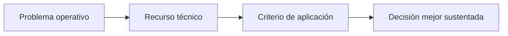
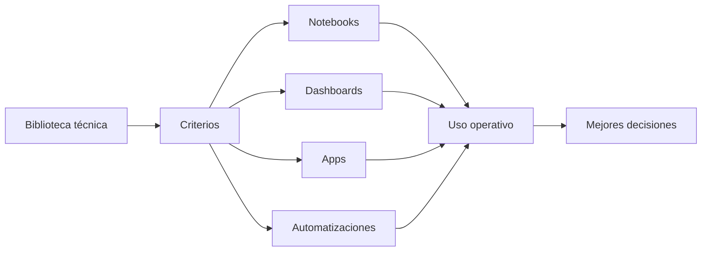

# Biblioteca Técnica Quality Analytics

Guías y artículos para profesionales de calidad, operaciones, mejora continua y analítica aplicada que necesitan convertir métodos técnicos en mejores decisiones.

La biblioteca cubre sistemas de gestión, auditoría, CAPA, SPC, MSA, DOE, Lean Six Sigma, costos de no calidad, analítica e inteligencia artificial aplicada a calidad.

---

## Buscar por problema operativo

| Si necesitas... | Empieza por... | Decisión que ayuda a mejorar |
|---|---|---|
| Fortalecer un sistema de calidad | ISO 9001 · ISO 19011 · CAPA | Qué procesos, riesgos, evidencias e indicadores gobernar mejor |
| Mejorar auditorías internas o de proveedores | ISO 19011 · CAPA | Cómo planificar, ejecutar y dar seguimiento a hallazgos útiles |
| Reducir reclamos o desviaciones recurrentes | CAPA · Costo de no calidad · Causa raíz | Cuándo contener, cuándo investigar y cómo verificar efectividad |
| Validar si tus datos de calidad son confiables | MSA · Gage R&R | Si el sistema de medición permite decidir con confianza |
| Pasar de gráficas a control real del proceso | SPC · Capacidad de proceso | Cuándo reaccionar, cuándo no sobreajustar y cómo definir planes de reacción |
| Probar variables de proceso con método | DOE · ANOVA · Regresión | Qué factores evaluar, cómo interpretar resultados y cómo validar mejoras |
| Priorizar mejoras por impacto económico | Costo de no calidad · Lean Six Sigma | Qué pérdidas convertir en proyectos de mejora |
| Aplicar IA en calidad con control de riesgo | IA en QMS · Validación de software · MSA | Dónde usar IA con trazabilidad, revisión humana y gobierno |
| Aplicar calidad y OPEX en sectores específicos | Empaques · Ingenios · Clínicas dentales | Cómo adaptar métodos generales al contexto operativo real |

---

## Rutas rápidas de lectura

### 1. Sistema de gestión de calidad

Para responsables de QMS, auditores internos, líderes de calidad y equipos de implementación.

1. [Guía práctica para implementar ISO 9001](https://qualityanalytics.net/wp-content/uploads/2026/05/guia_implementacion_iso_9001_2026.pdf)
2. [Guía completa de auditoría de sistemas de gestión basada en ISO 19011](https://qualityanalytics.net/wp-content/uploads/2026/05/guia_auditoria_iso_19011_2026.pdf)
3. [Guía práctica de CAPA y causa raíz](https://qualityanalytics.net/wp-content/uploads/2026/05/guia_capa_calidad_opex.pdf)

**Lectura útil:** pasar de documentación a gestión efectiva.

---

### 2. Calidad basada en datos

Para equipos que necesitan medir mejor, interpretar variación y tomar decisiones con datos confiables.

1. [Medir bien antes de decidir: MSA, Gage R&R y confiabilidad de mediciones](https://qualityanalytics.net/wp-content/uploads/2026/06/guia_msa_2026.pdf)
2. [SPC aplicado: de la gráfica al control del proceso](https://qualityanalytics.net/wp-content/uploads/2026/06/guia_spc_calidad_opex.pdf)
3. [Guía práctica de DOE para calidad y mejora de procesos](https://qualityanalytics.net/wp-content/uploads/2026/06/guia_doe_metodos_relacionados.pdf)

**Lectura útil:** saber si se mide bien, si el proceso es estable y qué variables explican el desempeño.

---

### 3. Excelencia operacional y priorización

Para líderes de mejora continua, Black Belts, gerentes de planta y equipos que necesitan priorizar esfuerzos.

1. [Herramientas de excelencia operacional y calidad 2026](https://qualityanalytics.net/wp-content/uploads/2026/04/herramientas_excelencia_operacional_calidad_2026.pdf)
2. [Costo de no calidad: cómo convertir pérdidas en decisiones de mejora](https://qualityanalytics.net/wp-content/uploads/2026/05/articulo_costo_no_calidad.pdf)
3. [Guía práctica para Black Belts en Ingenios Azucareros](https://qualityanalytics.net/wp-content/uploads/2026/05/guia_black_belt_ingenios.pdf)

**Lectura útil:** conectar pérdidas, datos, método, ejecución y sostenimiento.

---

### 4. IA aplicada a calidad

Para equipos que evalúan IA, automatización documental, RAG, clasificación o asistentes técnicos para QMS.

1. [IA aplicada a QMS, MSA y SPC](https://qualityanalytics.net/wp-content/uploads/2026/05/ia_qms_msa_spc.pdf)
2. [Validación de software open source en entornos regulados](https://qualityanalytics.net/wp-content/uploads/2026/04/guia_validacion_software_newsletter.pdf)
3. [Medir bien antes de decidir: MSA, Gage R&R y confiabilidad de mediciones](https://qualityanalytics.net/wp-content/uploads/2026/06/guia_msa_2026.pdf)

**Lectura útil:** aplicar IA con datos confiables, validación, trazabilidad, revisión humana y gobierno.

---

### 5. Aplicaciones sectoriales

Para equipos que necesitan adaptar calidad y mejora continua a contextos concretos.

1. [Guía introductoria para Ingenieros de Calidad en Empaques para Alimentos](https://qualityanalytics.net/wp-content/uploads/2026/04/guia_cqe_empaques.pdf)
2. [Guía práctica para Black Belts en Ingenios Azucareros](https://qualityanalytics.net/wp-content/uploads/2026/05/guia_black_belt_ingenios.pdf)
3. [Lean Healthcare aplicado a clínicas dentales](https://qualityanalytics.net/wp-content/uploads/2026/06/lean_healthcare_clinica_dental.pdf)

**Lectura útil:** aplicar método técnico según proceso, riesgo, flujo, datos disponibles y cliente.

---

## Índice de recursos

## Sistemas de gestión de calidad y auditoría

### [Guía práctica para implementar ISO 9001](https://qualityanalytics.net/wp-content/uploads/2026/05/guia_implementacion_iso_9001_2026.pdf)

Ruta práctica para implementar sistemas de gestión de calidad: contexto, procesos, riesgos, controles, evidencia, indicadores, mejora y preparación para certificación.

**Útil para:** responsables de calidad, dueños de proceso, equipos de implementación y alta dirección.  
**Ayuda a decidir:** cómo convertir la norma en un sistema de gestión operativo.

### [Guía completa de auditoría de sistemas de gestión basada en ISO 19011](https://qualityanalytics.net/wp-content/uploads/2026/05/guia_auditoria_iso_19011_2026.pdf)

Guía práctica para gestionar programas de auditoría, planificación, ejecución, evidencia, hallazgos, informes, seguimiento y competencia del auditor.

**Útil para:** auditores internos, auditores de proveedores, líderes de equipos auditores y responsables de programas de auditoría.  
**Ayuda a decidir:** cómo diseñar auditorías que generen evidencia confiable y hallazgos útiles.

### [Guía práctica de CAPA y causa raíz](https://qualityanalytics.net/wp-content/uploads/2026/05/guia_capa_calidad_opex.pdf)

Guía para contención, corrección, análisis de causa raíz, acción correctiva, verificación de eficacia, prevención de recurrencia y aprendizaje organizacional.

**Útil para:** calidad, mejora continua, operaciones y dueños de proceso.  
**Ayuda a decidir:** cuándo abrir una CAPA formal, cómo investigar y cómo verificar efectividad.

---

## Calidad basada en datos

### [Medir bien antes de decidir: MSA, Gage R&R y confiabilidad de mediciones](https://qualityanalytics.net/wp-content/uploads/2026/06/guia_msa_2026.pdf)

Guía práctica sobre análisis de sistemas de medición, metrología, calibración, verificación y confiabilidad de los datos usados para decisiones de calidad.

**Útil para:** calidad, metrología, manufactura, validación, ingeniería y equipos que usan datos para liberar, rechazar o ajustar procesos.  
**Ayuda a decidir:** si los datos disponibles son suficientemente confiables para tomar decisiones.

### [SPC aplicado: de la gráfica al control del proceso](https://qualityanalytics.net/wp-content/uploads/2026/06/guia_spc_calidad_opex.pdf)

Guía práctica sobre variación común y especial, límites de control, estabilidad, capacidad, señales, reacción operativa y mejora continua.

**Útil para:** calidad, producción, mejora continua e ingeniería de procesos.  
**Ayuda a decidir:** cuándo reaccionar, cuándo no sobreajustar y cómo convertir señales estadísticas en acción operativa.

### [Guía práctica de DOE para calidad y mejora de procesos](https://qualityanalytics.net/wp-content/uploads/2026/06/guia_doe_metodos_relacionados.pdf)

Guía para diseñar, ejecutar e interpretar experimentos aplicados a procesos industriales y de servicios, integrando comparación de medias, ANOVA, regresión, diseños factoriales, superficie de respuesta, optimización, validación de resultados y criterios de decisión operacional.

**Útil para:** Black Belts, ingenieros de proceso, calidad, mejora continua, I+D y equipos técnicos.  
**Ayuda a decidir:** qué variables probar, cómo interpretar resultados y cómo validar mejoras antes de escalar.

### [IA aplicada a QMS, MSA y SPC](https://qualityanalytics.net/wp-content/uploads/2026/05/ia_qms_msa_spc.pdf)

Artículo técnico sobre IA tradicional e IA generativa aplicada a sistemas de calidad, medición, SPC, CAPA, validación, gobierno y responsabilidad profesional.

**Útil para:** líderes de calidad, analistas, responsables de QMS y equipos que evalúan IA aplicada a calidad.  
**Ayuda a decidir:** dónde aplicar IA con valor real y riesgo controlado.

### [Herramientas de excelencia operacional y calidad 2026](https://qualityanalytics.net/wp-content/uploads/2026/04/herramientas_excelencia_operacional_calidad_2026.pdf)

Artículo técnico sobre herramientas y arquitecturas de trabajo para calidad, Lean Six Sigma, analítica, reproducibilidad y trabajo asistido por IA.

**Útil para:** profesionales que construyen sistemas de mejora, tableros, herramientas analíticas o flujos de trabajo técnicos.  
**Ayuda a decidir:** qué herramientas usar, bajo qué condiciones y con qué controles mínimos.

### [Costo de no calidad: cómo convertir pérdidas en decisiones de mejora](https://qualityanalytics.net/wp-content/uploads/2026/05/articulo_costo_no_calidad.pdf)

Artículo técnico sobre costos de no calidad, pérdidas operativas, desperdicio, reprocesos, reclamos y uso de evidencia económica para priorizar mejoras.

**Útil para:** calidad, operaciones, finanzas, mejora continua y gerencias de planta.  
**Ayuda a decidir:** cómo priorizar mejoras usando impacto económico y evidencia operativa.

---

## Calidad sectorial y excelencia operacional aplicada

### [Guía introductoria para Ingenieros de Calidad en Empaques para Alimentos](https://qualityanalytics.net/wp-content/uploads/2026/04/guia_cqe_empaques.pdf)

Guía sectorial sobre calidad en empaques, materiales en contacto con alimentos, defectología, inspección, metrología, trazabilidad, liberación y sistemas de gestión.

**Útil para:** ingenieros de calidad, supervisores, auditores y equipos técnicos en empaques para alimentos.  
**Ayuda a decidir:** qué controlar, cómo inspeccionar y cómo conectar defectos, proceso, inocuidad y cliente.

### [Guía práctica para Black Belts en Ingenios Azucareros](https://qualityanalytics.net/wp-content/uploads/2026/05/guia_black_belt_ingenios.pdf)

Guía sectorial sobre Lean Six Sigma, DMAIC, pérdidas operacionales, productividad, energía, confiabilidad, calidad, indicadores y sostenimiento en ingenios azucareros.

**Útil para:** Black Belts, gerentes de operación, mejora continua, mantenimiento, calidad y líderes industriales.  
**Ayuda a decidir:** cómo seleccionar, ejecutar y sostener proyectos de mejora en un sistema industrial complejo.

### [Lean Healthcare aplicado a clínicas dentales](https://qualityanalytics.net/wp-content/uploads/2026/06/lean_healthcare_clinica_dental.pdf)

Guía sectorial sobre aplicación de Lean Healthcare, calidad, flujo de pacientes, tiempos de espera, experiencia del paciente, estandarización, indicadores y mejora operacional en clínicas dentales.

**Útil para:** clínicas dentales, profesionales de salud, administradores de clínica y equipos que buscan mejorar flujo y experiencia del paciente.  
**Ayuda a decidir:** cómo aplicar mejora operacional en servicios de salud sin perder el foco clínico y humano.

---

## Artículos técnicos especializados

### [Estadística bayesiana vs. frecuentista aplicada a calidad](https://qualityanalytics.net/wp-content/uploads/2026/04/estadistica_bayesiana_vs_frecuentista.pdf)

Artículo técnico sobre pensamiento estadístico para decisiones de calidad con datos limitados, evidencia previa, comportamiento de procesos, evaluación de proveedores y análisis de causa raíz.

**Útil para:** analistas, ingenieros de calidad, mejora continua, evaluación de proveedores y equipos que trabajan con incertidumbre.  
**Ayuda a decidir:** cómo razonar con evidencia limitada sin perder rigor técnico.

### [Validación de software open source en entornos regulados](https://qualityanalytics.net/wp-content/uploads/2026/04/guia_validacion_software_newsletter.pdf)

Artículo técnico sobre validación basada en riesgo, uso previsto, requisitos, IQ/OQ/PQ, integridad de datos, control de versiones y mantenimiento del estado validado.

**Útil para:** calidad, validación, IT, analítica, automatización y equipos que usan herramientas digitales en entornos regulados o controlados.  
**Ayuda a decidir:** cómo usar software open source o herramientas internas con control de riesgo, evidencia y trazabilidad.

---

## Relación con los repositorios técnicos

La biblioteca organiza el criterio. Los repositorios convierten parte de ese criterio en herramientas reproducibles.

Cada herramienta debe responder a una necesidad técnica: medir mejor, interpretar mejor, documentar mejor, auditar mejor, priorizar mejor o decidir mejor.
